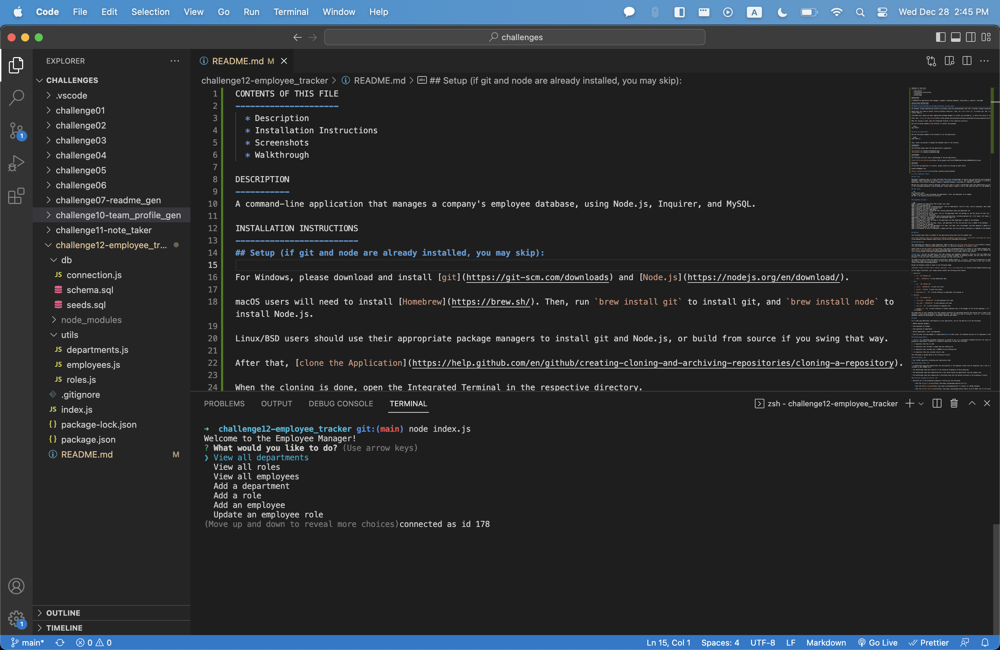
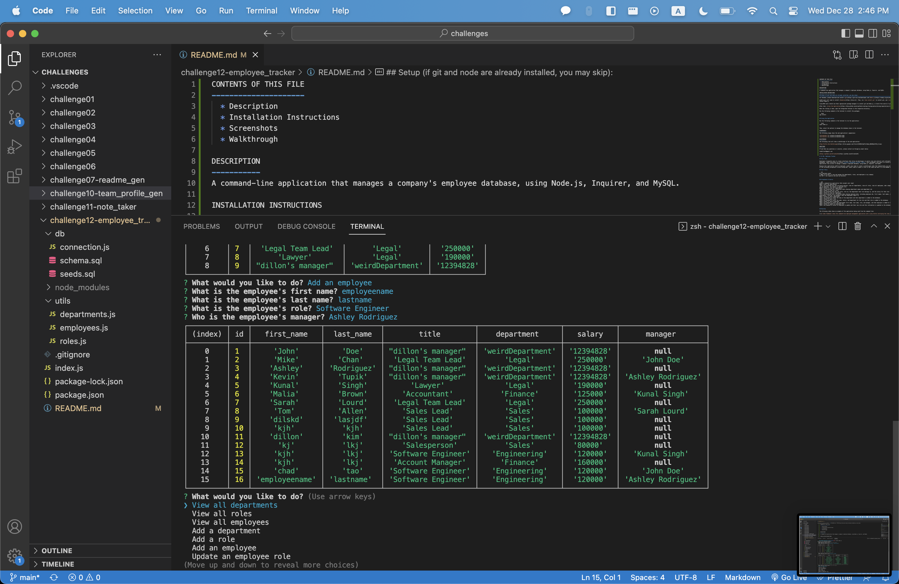

CONTENTS OF THIS FILE
---------------------
  * Description
  * Installation Instructions
  * Screenshots
  * Walkthrough
  
DESCRIPTION
-----------
A command-line application that manages a company's employee database, using Node.js, Inquirer, and MySQL.

INSTALLATION INSTRUCTIONS
-------------------------
## Setup (if git and node are already installed, you may skip): 

For Windows, please download and install [git](https://git-scm.com/downloads) and [Node.js](https://nodejs.org/en/download/).

macOS users will need to install [Homebrew](https://brew.sh/). Then, run `brew install git` to install git, and `brew install node` to install Node.js.

Linux/BSD users should use their appropriate package managers to install git and Node.js, or build from source if you swing that way.

After that, [clone the Application](https://help.github.com/en/github/creating-cloning-and-archiving-repositories/cloning-a-repository).

When the cloning is done, open the Integrated Terminal in the respective directory. 

Run the following command in the terminal to install the packages: 

```bash
npm install
```

You will also need to install MySQL to your machine and run the schema.sql and seeds.sql files to create the database/tables.

## Using the Application

Run the following command in the terminal to run the application: 

```bash
node index.js
```

Then, select the options to manage the database shown in the terminal. 

SCREENSHOTS
-----------
The following image shows the web application's appearance:





WALKTHROUGH
-----------
The following link will show a walkthrough of the web application: 

[Employee Tracker Walkthrough](https://drive.google.com/file/d/1U5jotfaR9KL03OYJvaqZKGYMcxb8zm2W/view)

QUESTIONS
---------
If you have any questions or concerns, please contact me through my email below: 

kimdillon19@gmail.com

[https://github.com/dillonkim19](https://github.com/dillonkim19)